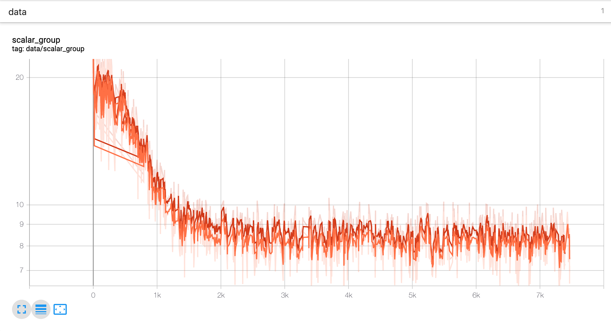

# ALBERT-Pytorch

Simply implementation of [ALBERT(A LITE BERT FOR SELF-SUPERVISED LEARNING OF LANGUAGE REPRESENTATIONS)](https://arxiv.org/pdf/1909.11942.pdf) in Pytorch. This implementation is based on clean [dhlee347](https://github.com/dhlee347)/[pytorchic-bert](https://github.com/dhlee347/pytorchic-bert) code.

Please make sure that I haven't checked the performance yet(i.e Fine-Tuning), only see SOP(sentence-order prediction) and MLM(Masked Langauge model with n-gram) loss falling.

- You can see [my implementation of differnt between Original BERT and ALBERT](https://github.com/graykode/ALBERT-Pytorch/commit/757fd6d5de5407f47eb44a6c5c96a3ab203f98d4)

**CAUTION** Fine-Tuning Tasks not yet!


## File Overview

This contains 9 python files.
- [`tokenization.py`](./tokenization.py) : Tokenizers adopted from the original Google BERT's code
- [`models.py`](./models.py) : Model classes for a general transformer
- [`optim.py`](./optim.py) : A custom optimizer (BertAdam class) adopted from Hugging Face's code
- [`train.py`](./train.py) : A helper class for training and evaluation
- [`utils.py`](./utils.py) : Several utility functions
- [`pretrain.py`](./pretrain.py) : An example code for pre-training transformer


## PreTraining

With [WikiText 2](https://s3.amazonaws.com/research.metamind.io/wikitext/wikitext-2-v1.zip) Dataset to try Unit-Test on GPU(t2.xlarge). You can also use parallel Multi-GPU or CPU.

```shell
$ CUDA_LAUNCH_BLOCKING=1 python pretrain.py \
			--data_file './data/wiki.train.tokens' \
			--vocab './data/vocab.txt' \
			--train_cfg './config/pretrain.json' \
			--model_cfg './config/albert_unittest.json' \
			--max_pred 75 --mask_prob 0.15 \
			--mask_alpha 4 --mask_beta 1 --max_gram 3 \
			--save_dir './saved' \
			--log_dir './logs'
			
cuda (1 GPUs)
Iter (loss=19.162): : 526it [02:25,  3.58it/s]
Epoch 1/25 : Average Loss 18.643
Iter (loss=12.589): : 524it [02:24,  3.63it/s]
Epoch 2/25 : Average Loss 13.650
Iter (loss=9.610): : 523it [02:24,  3.62it/s]
Epoch 3/25 : Average Loss 9.944
Iter (loss=10.612): : 525it [02:24,  3.60it/s]
Epoch 4/25 : Average Loss 9.018
Iter (loss=9.547): : 527it [02:25,  3.66it/s]
...
```

**TensorboardX** : `loss_lm` + `loss_sop`.
```shell
# to use TensorboardX
$ pip install tensorflow tensorboardX
$ tensorboard --logdir logs # expose http://server-ip:6006/
```



## Introduce Keywords in ALBERT with code.

1. [**SOP(sentence-order prediction) loss**](https://github.com/graykode/ALBERT-Pytorch/blob/master/pretrain.py#L78) : In Original BERT, creating  is-not-next(negative) two sentences with randomly picking, however ALBERT use negative examples the same two consecutive segments but with their order swapped.

   ```python
   is_next = rand() < 0.5 # whether token_b is next to token_a or not
   
   tokens_a = self.read_tokens(self.f_pos, len_tokens, True)
   seek_random_offset(self.f_neg)
   #f_next = self.f_pos if is_next else self.f_neg
   f_next = self.f_pos # `f_next` should be next point
   tokens_b = self.read_tokens(f_next, len_tokens, False)
   
   if tokens_a is None or tokens_b is None: # end of file
   self.f_pos.seek(0, 0) # reset file pointer
   return
   
   # SOP, sentence-order prediction
   instance = (is_next, tokens_a, tokens_b) if is_next \
   else (is_next, tokens_b, tokens_a)
   ```

2. [**Cross-Layer Parameter Sharing**](https://github.com/graykode/ALBERT-Pytorch/blob/master/models.py#L155) : ALBERT use cross-layer parameter sharing in Attention and FFN(FeedForward Network) to reduce number of parameter.
  
   ```python
   class Transformer(nn.Module):
       """ Transformer with Self-Attentive Blocks"""
       def __init__(self, cfg):
           super().__init__()
           self.embed = Embeddings(cfg)
           # Original BERT not used parameter-sharing strategies
           # self.blocks = nn.ModuleList([Block(cfg) for _ in range(cfg.n_layers)])
   
           # To used parameter-sharing strategies
           self.n_layers = cfg.n_layers
           self.attn = MultiHeadedSelfAttention(cfg)
           self.proj = nn.Linear(cfg.hidden, cfg.hidden)
           self.norm1 = LayerNorm(cfg)
           self.pwff = PositionWiseFeedForward(cfg)
           self.norm2 = LayerNorm(cfg)
           # self.drop = nn.Dropout(cfg.p_drop_hidden)
   
       def forward(self, x, seg, mask):
           h = self.embed(x, seg)
   
           for _ in range(self.n_layers):
               # h = block(h, mask)
               h = self.attn(h, mask)
               h = self.norm1(h + self.proj(h))
               h = self.norm2(h + self.pwff(h))
   
           return h
   ```

3. [**Factorized Embedding Parameterziation**](https://github.com/graykode/ALBERT-Pytorch/blob/master/models.py#L67) : ALBERT seperated Embedding matrix(VxD) to VxE and ExD.

   ```python
   class Embeddings(nn.Module):
       "The embedding module from word, position and token_type embeddings."
    def __init__(self, cfg):
           super().__init__()
           # Original BERT Embedding
           # self.tok_embed = nn.Embedding(cfg.vocab_size, cfg.hidden) # token embedding
   
           # factorized embedding
           self.tok_embed1 = nn.Embedding(cfg.vocab_size, cfg.embedding)
           self.tok_embed2 = nn.Linear(cfg.embedding, cfg.hidden)
   
           self.pos_embed = nn.Embedding(cfg.max_len, cfg.hidden) # position embedding
           self.seg_embed = nn.Embedding(cfg.n_segments, cfg.hidden) # segment(token type) embedding

4. [**n-gram MLM**](https://github.com/graykode/ALBERT-Pytorch/blob/master/utils.py#L107) : MLM targets using n-gram masking (Joshi et al., 2019). Same as Paper, I use 3-gram. Code Reference from [XLNET implementation](https://github.com/zihangdai/xlnet/blob/master/data_utils.py#L331).
   <p align="center"></p>

#### Cannot Implemente now

- In Paper, They use a batch size of 4096 LAMB optimizer with learning rate 0.00176 (You et al., 2019), train all model in 125,000 steps.


## Author

- Tae Hwan Jung(Jeff Jung) @graykode, Kyung Hee Univ CE(Undergraduate).
- Author Email : [nlkey2022@gmail.com](mailto:nlkey2022@gmail.com)
